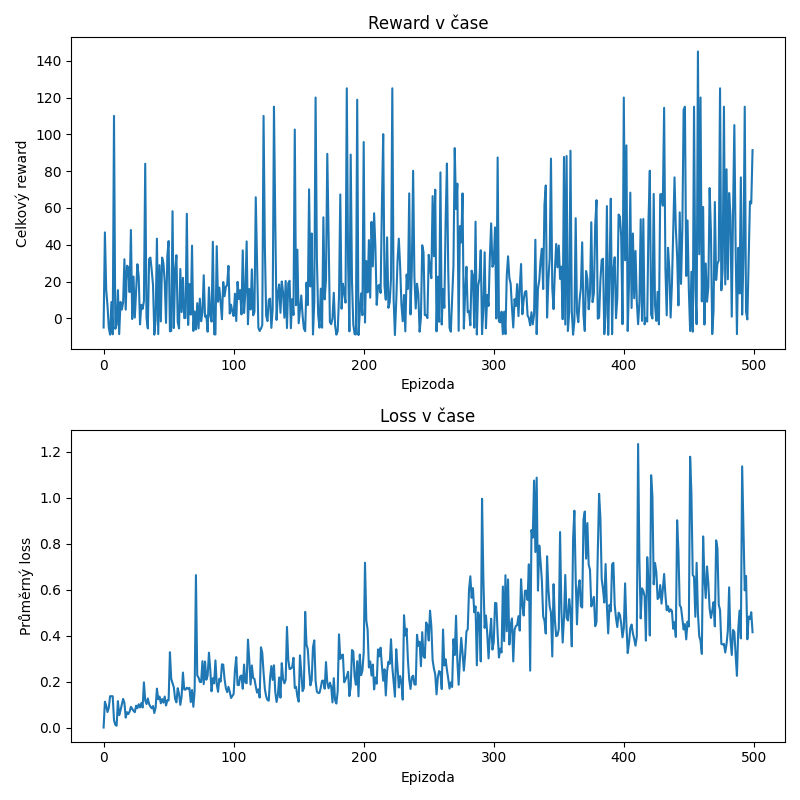

# Dodge Game RL Agent

A custom Pygame survival game paired with a Deep Q-Network (DQN) agent implemented from scratch in PyTorch — no RL libraries (e.g. Stable-Baselines3) involved. Built as a portfolio project to demonstrate understanding of reinforcement learning fundamentals, not just how to call `.fit()`.


*(GIF placeholder — record a `play.py` session and drop it in `docs/demo.gif`)*

## Why a custom game?

Most RL portfolio projects lean on Gym's CartPole or Atari environments. I wanted full control over the state representation and reward design instead — the parts of an RL problem that actually require judgment calls, not just wiring up a pre-built environment. Building the game myself also meant the environment and the agent could be developed and debugged independently, which turned out to matter a lot (see "What I learned" below).

## What the game is

A top-down survival game on a discrete 10×15 grid:
- The player moves in 2D (left / right / up / down / stay)
- Obstacles fall from the top and speed up as difficulty **levels** increase (every 200 steps)
- Bonus items occasionally fall and reward the player for collecting them
- The episode ends on collision with an obstacle

## Architecture

| File | Responsibility |
|---|---|
| `game.py` | The environment — game logic, state/reward computation, and Pygame rendering. Exposes a Gym-like API (`reset()`, `step(action)`) so it runs headless during training and only renders during play. |
| `agent.py` | The DQN agent — Q-network, replay buffer, target network, epsilon-greedy action selection, and the training step (Bellman equation + backprop). |
| `train.py` | The training loop — runs episodes, logs reward/loss, saves the trained model and training curves. |
| `play.py` | Loads the trained model and runs it live, greedy (no exploration), in a rendered window. |

## How to run

```bash
pip install -r requirements.txt
python train.py   # trains for 500 episodes, saves trained_agent.pth + training_progress.png
python play.py    # watches the trained agent play live
```

## Design decisions

- **Discrete grid over raw pixels**: a flattened grid state (150 values) keeps training fast on CPU and the network small, at the cost of losing some spatial structure a CNN would preserve. Documented as a possible extension below.
- **Reward shaping**: a small per-step "alive" reward (+0.1) encourages survival, a bonus pickup reward (+5), and a death penalty (-10). Kept as named constants so they're easy to retune.
- **Level-based difficulty**: obstacle spawn rate increases every 200 steps, which doubles as a simple, interpretable progress metric during evaluation.
- **Target network + replay buffer**: standard DQN stabilization — without them, training is visibly less stable (Q-values chase a constantly-moving target).

## What I learned (debugging story)

The first trained agent looked like it had learned almost nothing when watched live, despite a training run showing rising reward — the two seemed to contradict each other. Working through it systematically ruled out one hypothesis at a time:

- **Was the training loop broken?** No — the reported loss was being computed correctly and wasn't NaN or exploding.
- **Was the loss failing to decrease?** It was actually *increasing* over training, which looked alarming at first — but this turned out to be expected: as the agent learns to survive longer, the target Q-values it's trying to predict naturally grow in magnitude, and MSE loss scales with the square of that magnitude. Rising loss alongside rising reward is consistent, not contradictory.
- **So why did the live agent look random?** The actual cause was mundane: `play.py` had loaded a stale `trained_agent.pth` from an earlier, weaker training run. Reloading the freshly-trained weights immediately fixed it — the agent was reaching levels 5–8 instead of 1–3.

The takeaway: a metric that looks wrong in isolation (rising loss) isn't automatically a bug, and it's worth checking the mundane explanations (stale files, mismatched runs) before assuming the algorithm itself is broken.

## Results

- Trained for 500 episodes with epsilon decaying from 1.0 to 0.05
- Reward per episode is noisy (as expected for DQN) but trends upward, with late-training episodes regularly exceeding 100 total reward vs. under 30 early on
- The trained agent consistently reaches level 5–8 (vs. level 1 for a random policy)



## Limitations & possible extensions

- Results are solid but not optimal — a longer training run, Double DQN, or prioritized experience replay would likely improve consistency
- The flattened-grid state discards spatial structure; a CNN over a small image-like representation could plausibly do better with more training time
- No hyperparameter sweep was performed; learning rate, network size, and epsilon decay were set to reasonable defaults rather than tuned

## Requirements

See `requirements.txt`. Core dependencies: `pygame`, `torch`, `numpy`, `matplotlib`.
